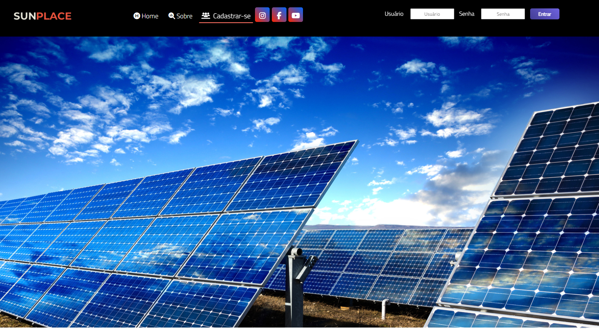
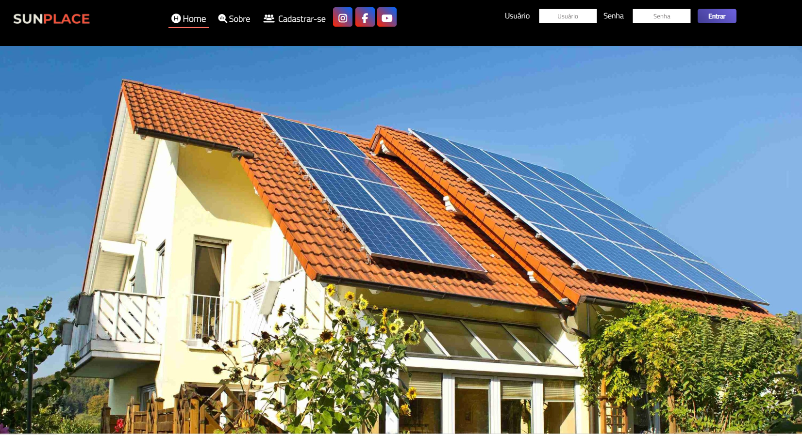
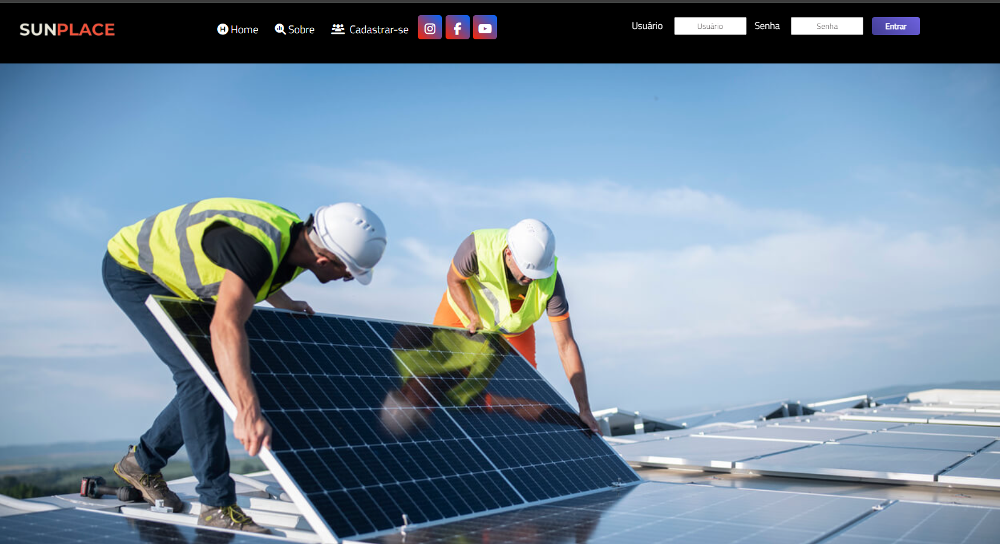
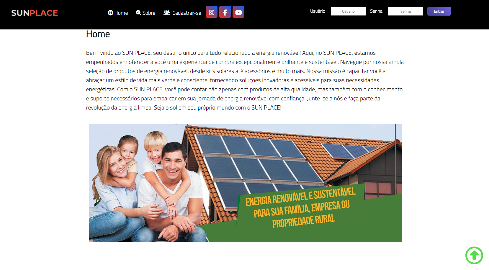
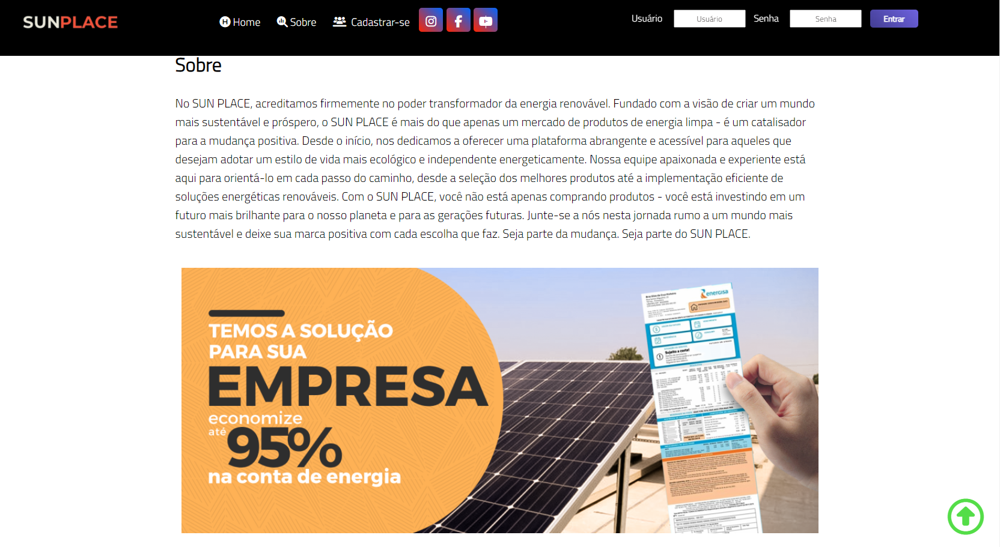
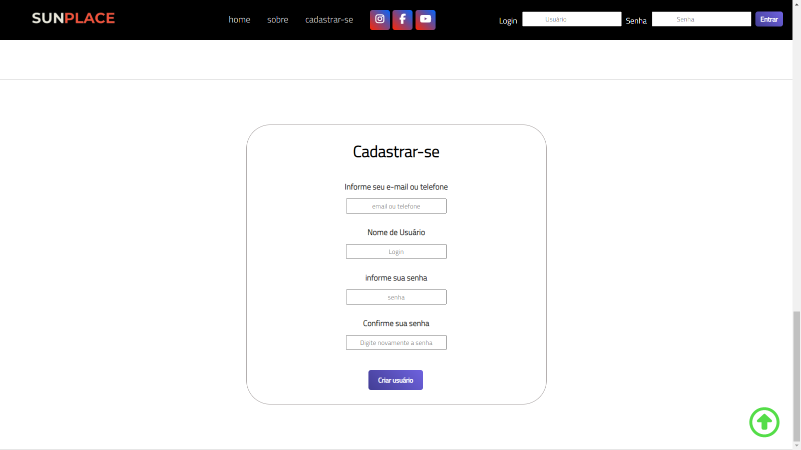
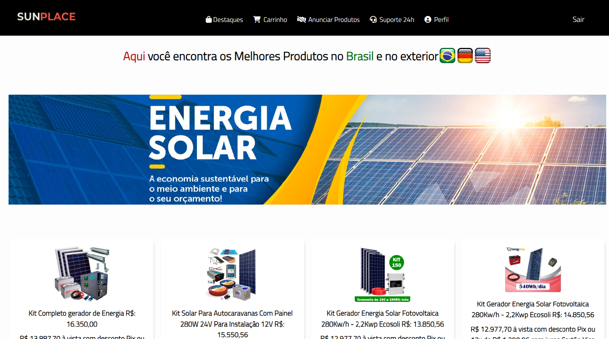
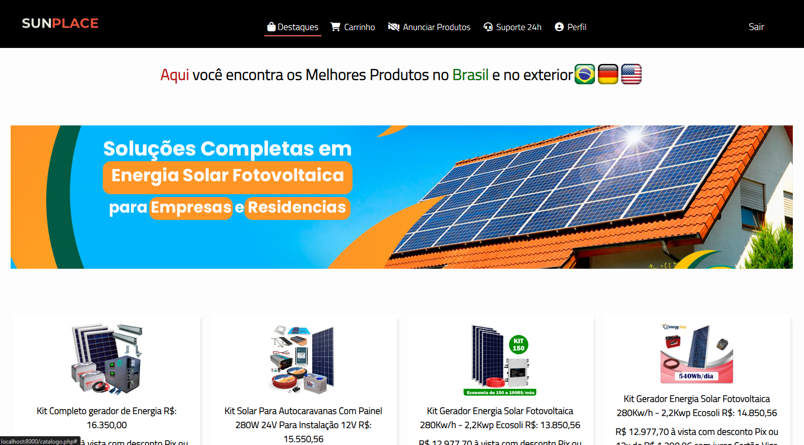
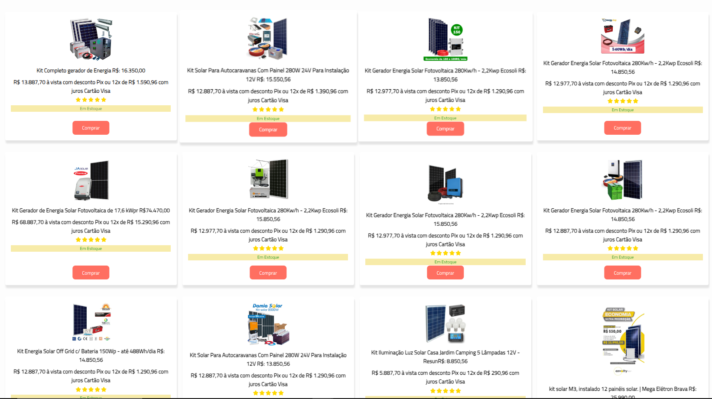

# Projeto de UPX -3 Market Place SUNPLANCE

## Tecnologias Utilizadas
O projeto foi desenvolvido utilizando as seguintes tecnologias:
- PHP
- HTML
- CSS
- JavaScript

## Banco de Dados
- MySQL

